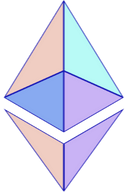
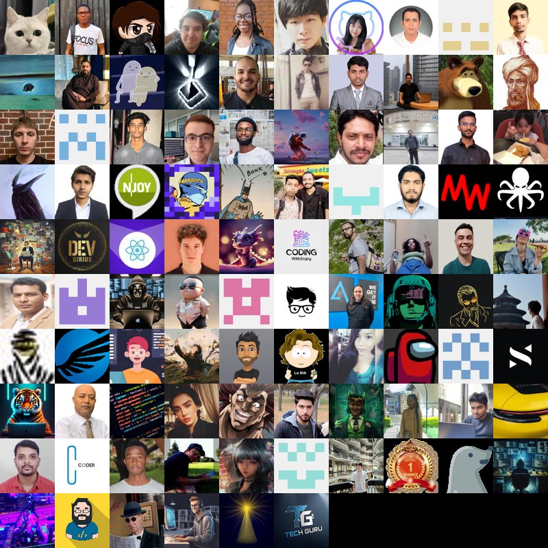

<!-- ### Hi there 👋 -->

<!--
**Colt-M1873/Colt-M1873** is a ✨ _special_ ✨ repository because its `README.md` (this file) appears on your GitHub profile.

Here are some ideas to get you started:

- 🔭 I’m currently working on ...
- 🌱 I’m currently learning ...
- 👯 I’m looking to collaborate on ...
- 🤔 I’m looking for help with ...
- 💬 Ask me about ...
- 📫 How to reach me: ...
- 😄 Pronouns: ...
- ⚡ Fun fact: ...
-->

  

<!--   

  

  

  

  

  

  
   -->

  

    

##  Leetcode      

  	 

  

        
          

  
    

## 👨‍💻 Contributed to

<!-- 

translate github profile 3d contrib page

## 📰 📝 Recent activity (or blogpost) 

blogpost/translation

show your blogpost here

and your rss3 feed or medium feed

-->

## 📈 Github stats

<!--

-->
<!-- 

 -->

 

<!--

-->

## ✨ Followers

  
    

**Best Wishes**
